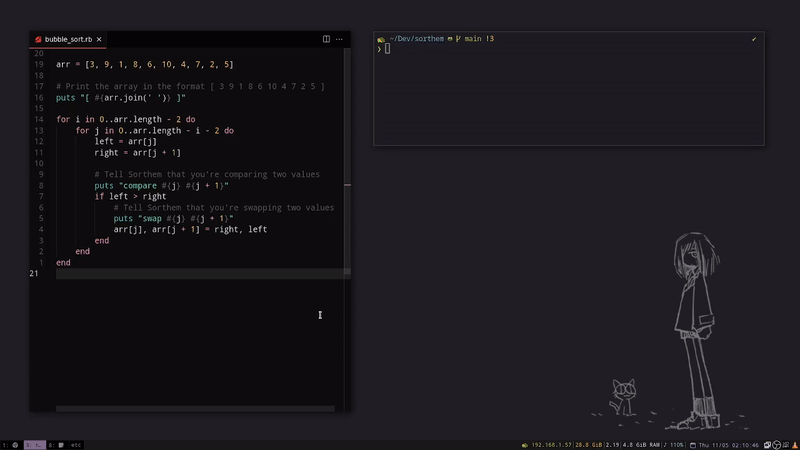

<!-- markdownlint-disable MD033 -->
# Sorthem

Te acuerdas de esos algoritmos de ordenamiento (bubble sort, selection sort, radix sort) que
te hacen crear en tu colegio/universidad?

No te gustaría poder visualizar esos algoritmos en tiempo real? en el lenguaje que quieras?

Sorthem es una herramineta que te permite visualizar TUS algoritmos de ordenamiento
de forma fácil y sencilla, solo añadiendo unas pocas líneas de código!!! 🙀🙀



## Compilando Sorthem en tu PC

### Paso 1. Instalar SFML

Sorthem tiene como única dependencia a [SFML](https://www.sfml-dev.org/) > 2.5
(librería de gráficos). La instalación de SFML depende de tu sistema operativo.
Ver [documentación oficial](https://www.sfml-dev.org/tutorials/latest).

#### Instalación de SMFL en Linux

Ejecuta los siguientes comandos en tu terminal:

```bash
# Para 
sudo apt update
sudo apt install libsfml-dev
```

#### Instalación de SMFL en MacOS

Es preferible que uses `homebrew` como gestor de paquetes [homebrew](https://brew.sh/index_es).

Si no tienes instalado `homebrew` ejecuta el siguiente comando:

```bash
/bin/bash -c "$(curl -fsSL https://raw.githubusercontent.com/Homebrew/install/HEAD/install.sh)"
```

Una vez instalado `homebrew`, ejecuta los siguientes comandos para instalar SFML:

```bash
# On MacOS
brew install sfml
```

#### Instalación de SFML en Windows

No existen paquetes oficiales de SFML para Windows, pero puedes descargar los binarios
desde la [página oficial](https://www.sfml-dev.org/download/sfml/2.5.1/).

### Paso 2. Compilar el proyecto sorthem

Una vez instalado SFML, ya puedes compilar `sorthem` con los siguients comandos.

Clona el repositorio:

```bash
git clone https://github.com/RicardoCalderon21/TAREA2_IDS_2023
```

Entra a la carpeta clonada

```bash
cd sorthem
```

Compila el proyecto con el script de bash `build.sh`:

```bash
./build.sh
```

> Nota: en Windows no existe Bash, es recomendable usar la [Git bash](https://gitforwindows.org/).

### Prueba Sorthem

```bash
cat examples/test | dist/sorthem
```

## Getting started

### Usage

```bash
your_sorting_algorithm | sorthem
```

### Controls

- <kbd>Space</kbd> - pause/resume
- <kbd>R</kbd> - restart
- <kbd>&uparrow;</kbd> - speed up
- <kbd>&downarrow;</kbd> - speed down


## How does it work?

Sorthem is simple. You have a sorting algorithm, written in **whatever
language you like**. Let's say, a **bubble sort** implementation in **Ruby**:

```ruby
arr = [3, 9, 1, 8, 6, 10, 4, 7, 2, 5]

for i in 0..arr.length - 2 do
    for j in 0..arr.length - i - 2 do
        left = arr[j]
        right = arr[j + 1]

        if left > right
            arr[j], arr[j + 1] = right, left
        end
    end
end
```

Almost all algorithms are made up with [basic operations](#basic-operations)
like comparing two values, swapping them, etc.

Sorthem needs to know two things:

- what are the values you're sorting
- what are the operations you're doing in order to sort those values

An all you need to do is to **print** that information to the standard output.

```ruby
arr = [3, 9, 1, 8, 6, 10, 4, 7, 2, 5]

# Print the array in the format [ 3 9 1 8 6 10 4 7 2 5 ]
puts "[ #{arr.join(' ')} ]"

for i in 0..arr.length - 2 do
    for j in 0..arr.length - i - 2 do
        left = arr[j]
        right = arr[j + 1]

        # Tell Sorthem that you're comparing two values
        puts "compare #{j} #{j + 1}"
        if left > right
            # Tell Sorthem that you're swapping two values
            puts "swap #{j} #{j + 1}"
            arr[j], arr[j + 1] = right, left
        end
    end
end
```

With these three lines of code, you now have a **visualizer** for your
algorithm. You can run it with:

```bash
ruby bubble_sort.rb | sorthem
```


Note that `compare` isn't actually needed. Only `swap` does the job of sorting
the array. `compare` is simply a helpful operation for visualization.

Of course, there are more types of operations for more **complex** algorithms,
each associated with [semantic color](#semantic-colors).

You have a variety of examples in the [examples](./examples/) directory (WIP).

## Basic operations

- **compare**: for comparing to indexes

  usage: `compare i j`

- **swap**: for swapping the values of two indexes

  usage: `swap i j`

- **get**: for consulting the value at some index

  usage: `get i`

- **set**: for setting an index to a value

  usage: `set i value`, where `0 <= value <= max_value`

`i` and `j` must be valid zero-based indexes.

## Semantic Colors

-  `#ffffff`: an iddle bar
-  `#f33232`: two bars being swaped
-  `#9b54c3`: getting the value of the bar
-  `#2d43db`: setting the value of the bar
-  `#e79933`: two bars are being compared
